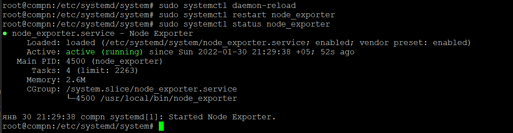
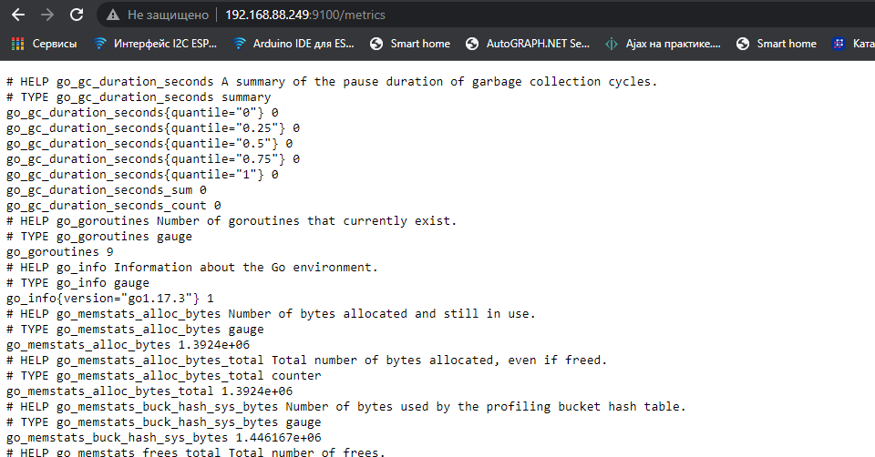
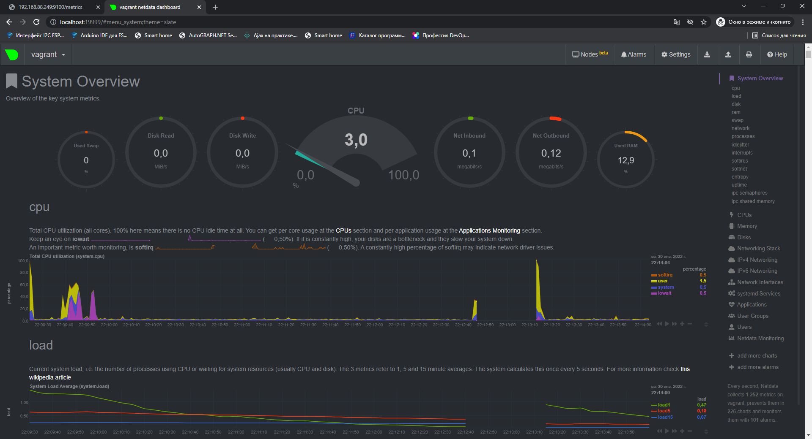
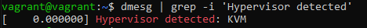
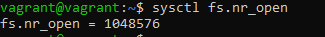
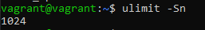
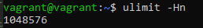
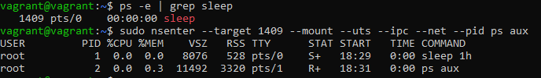
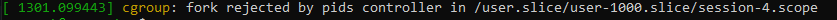

# Домашнее задание к занятию "3.4. Операционные системы, лекция 2"

1. На лекции мы познакомились с [node_exporter](https://github.com/prometheus/node_exporter/releases). В демонстрации его исполняемый файл запускался в background. Этого достаточно для демо, но не для настоящей production-системы, где процессы должны находиться под внешним управлением. Используя знания из лекции по systemd, создайте самостоятельно простой [unit-файл](https://www.freedesktop.org/software/systemd/man/systemd.service.html) для node_exporter:

    * поместите его в автозагрузку,
    * предусмотрите возможность добавления опций к запускаемому процессу через внешний файл (посмотрите, например, на `systemctl cat cron`),
    * удостоверьтесь, что с помощью systemctl процесс корректно стартует, завершается, а после перезагрузки автоматически поднимается.

```
>wget https://github.com/prometheus/node_exporter/releases/download/v1.3.1/node_exporter-1.3.1.linux-amd64.tar.gz    
>переносим файл из архива /usr/local/bin/  
создаем парамерты возможность добавления опций к запускаемому процессу через внешний файл   
#echo "EXTRA_OPTS=\"--log.level=info\"" > /opt/node_exporter.env  
создаем файл конфигурации
sudo tee /etc/systemd/system/node_exporter.service<<EOF  
[Unit]  
Description=Node Exporter  
After=network.target  
   
[Service]  
Type=simple  
EnvironmentFile=/opt/node_exporter.env 
ExecStart=/usr/local/bin/node_exporter $EXTRA_OPTS
StandardOutput=file:/var/log/node_explorer.log
StandardError=file:/var/log/node_explorer.log 
   
[Install]  
WantedBy=multi-user.target  
EOF  

sudo systemctl daemon-reload
sudo systemctl start node_exporter
sudo systemctl enable node_exporter
```



2. Ознакомьтесь с опциями node_exporter и выводом `/metrics` по-умолчанию. Приведите несколько опций, которые вы бы выбрали для базового мониторинга хоста по CPU, памяти, диску и сети.  


```
CPU: system, user покажут время, использованное системой и программами; слишком высокий steal будет означать, что гипервизор перегружен и процессор занят другими ВМ; iowait - поможет отследить, всё ли в порядке с дисковой системой.
# TYPE node_cpu_seconds_total counter`
node_cpu_seconds_total{cpu="0",mode="idle"} 27.36
node_cpu_seconds_total{cpu="0",mode="iowait"} 0.52
node_cpu_seconds_total{cpu="0",mode="irq"} 0
node_cpu_seconds_total{cpu="0",mode="nice"} 0
node_cpu_seconds_total{cpu="0",mode="softirq"} 0.17
node_cpu_seconds_total{cpu="0",mode="steal"} 0
node_cpu_seconds_total{cpu="0",mode="system"} 3.47
node_cpu_seconds_total{cpu="0",mode="user"} 2.96
node_cpu_seconds_total{cpu="1",mode="idle"} 28.92
node_cpu_seconds_total{cpu="1",mode="iowait"} 0.2
node_cpu_seconds_total{cpu="1",mode="irq"} 0
node_cpu_seconds_total{cpu="1",mode="nice"} 0
node_cpu_seconds_total{cpu="1",mode="softirq"} 0.21
node_cpu_seconds_total{cpu="1",mode="steal"} 0
node_cpu_seconds_total{cpu="1",mode="system"} 2.66
node_cpu_seconds_total{cpu="1",mode="user"} 2.34

MEM: MemTotal - количество памяти; MemFree и MemAvailable - свободная и доступная память; SwapTotal, SwapFree, SwapCached - своп, если слишком много занято -- RAM не хватает.
# TYPE node_memory_MemAvailable_bytes gauge
node_memory_MemAvailable_bytes 7.43829504e+08
# TYPE node_memory_MemFree_bytes gauge
node_memory_MemFree_bytes 6.51558912e+08
# TYPE node_memory_MemTotal_bytes gauge
node_memory_MemTotal_bytes 1.028694016e+09
# TYPE node_memory_SwapCached_bytes gauge
node_memory_SwapCached_bytes 0
# TYPE node_memory_SwapFree_bytes gauge
node_memory_SwapFree_bytes 1.027600384e+09
# TYPE node_memory_SwapTotal_bytes gauge
node_memory_SwapTotal_bytes 1.027600384e+09

DISK: size_bytes и avail_bytes покажут объём и свободное место; readonly=1 может говорить о проблемах ФС, из-за чего она перешла в режим только для чтения; io_now - интенсивность работы с диском в текущий момент.
# TYPE node_filesystem_avail_bytes gauge
node_filesystem_avail_bytes{device="/dev/mapper/vgvagrant-root",fstype="ext4",mountpoint="/"} 6.0764639232e+10
# TYPE node_filesystem_readonly gauge
node_filesystem_readonly{device="/dev/mapper/vgvagrant-root",fstype="ext4",mountpoint="/"} 0
# TYPE node_filesystem_size_bytes gauge
node_filesystem_size_bytes{device="/dev/mapper/vgvagrant-root",fstype="ext4",mountpoint="/"} 6.5827115008e+10
# TYPE node_disk_io_now gauge
node_disk_io_now{device="sda"} 0

NET: carrier_down, carrier_up - если много, значит проблема с физическим подключением; info - общая информация по интерфейсу; mtu_bytes - может быть важно для диагностики потерь или если трафик хостов не проходит через маршрутизатор; receive_errs_total, transmit_errs_total, receive_packets_total, transmit_packets_total - ошибки передачи, в зависимости от объёма, вероятно какие-то проблемы сети или с хостом
# TYPE node_network_carrier_down_changes_total counter
node_network_carrier_down_changes_total{device="eth0"} 1
# TYPE node_network_carrier_up_changes_total counter
node_network_carrier_up_changes_total{device="eth0"} 1
# TYPE node_network_info gauge
node_network_info{address="08:00:27:73:60:cf",broadcast="ff:ff:ff:ff:ff:ff",device="eth0",duplex="full",ifalias="",operstate="up"} 1
# TYPE node_network_mtu_bytes gauge
node_network_mtu_bytes{device="eth0"} 1500
# TYPE node_network_receive_errs_total counter
node_network_receive_errs_total{device="eth0"} 0
# TYPE node_network_receive_packets_total counter
node_network_receive_packets_total{device="eth0"} 351
# TYPE node_network_transmit_errs_total counter
node_network_transmit_errs_total{device="eth0"} 0
# TYPE node_network_transmit_packets_total counter
node_network_transmit_packets_total{device="eth0
```


3. Установите в свою виртуальную машину [Netdata](https://github.com/netdata/netdata). Воспользуйтесь [готовыми пакетами](https://packagecloud.io/netdata/netdata/install) для установки (`sudo apt install -y netdata`). После успешной установки:
    * в конфигурационном файле `/etc/netdata/netdata.conf` в секции [web] замените значение с localhost на `bind to = 0.0.0.0`,
    * добавьте в Vagrantfile проброс порта Netdata на свой локальный компьютер и сделайте `vagrant reload`:

    ```bash
    config.vm.network "forwarded_port", guest: 19999, host: 19999
    ```

    После успешной перезагрузки в браузере *на своем ПК* (не в виртуальной машине) вы должны суметь зайти на `localhost:19999`. Ознакомьтесь с метриками, которые по умолчанию собираются Netdata и с комментариями, которые даны к этим метрикам.
>Работы выполнены - результат.  


4. Можно ли по выводу `dmesg` понять, осознает ли ОС, что загружена не на настоящем оборудовании, а на системе виртуализации?
>да  
> 
5. Как настроен sysctl `fs.nr_open` на системе по-умолчанию? Узнайте, что означает этот параметр. Какой другой существующий лимит не позволит достичь такого числа (`ulimit --help`)?
>    
fs.nr_open - жесткий лимит на открытые дескрипторы для ядра (системы)  

>ulimit -Sn  
  
Soft limit на пользователя, может быть изменен как большую, так и меньшую сторону

> ulimit -Hn  
  
Hard limit на пользователя, может быть изменен только в меньшую сторону  
Оба ulimit -n не могут превышать fs.nr_open

6. Запустите любой долгоживущий процесс (не `ls`, который отработает мгновенно, а, например, `sleep 1h`) в отдельном неймспейсе процессов; покажите, что ваш процесс работает под PID 1 через `nsenter`. Для простоты работайте в данном задании под root (`sudo -i`). Под обычным пользователем требуются дополнительные опции (`--map-root-user`) и т.д.
>Terminal1  


>Terminal2  


7. Найдите информацию о том, что такое `:(){ :|:& };:`. Запустите эту команду в своей виртуальной машине Vagrant с Ubuntu 20.04 (**это важно, поведение в других ОС не проверялось**). Некоторое время все будет "плохо", после чего (минуты) – ОС должна стабилизироваться. Вызов `dmesg` расскажет, какой механизм помог автоматической стабилизации. Как настроен этот механизм по-умолчанию, и как изменить число процессов, которое можно создать в сессии?
>Это fork bomb, бесконечно создающая свои копии (системным вызовом fork())  
>   
>Значение TasksMax (изменение значения в %, конкретное число или infinity, чтобы убрать лимит) в /usr/lib/systemd/system/user-.slice.d/10-defaults.conf регулирует число процессов, которое можно создать в сессии